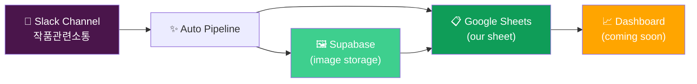
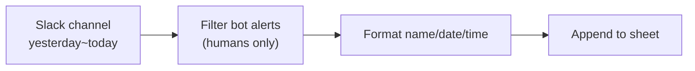
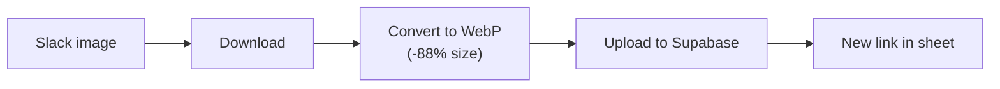
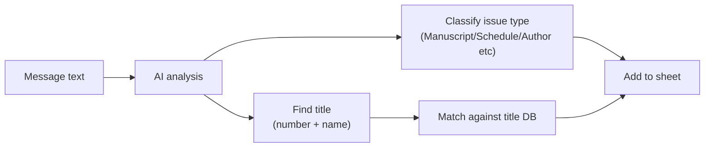
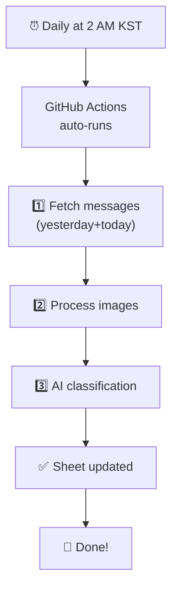

# 📡 Slack HUB

[한국어](./ARCHITECTURE.md) | 🌏 **English**

> A system that automatically organizes Slack channel messages and collects them into Google Sheets

---

## 🎯 What does it do?

Every day at 2 AM KST, automatically:

1. **Fetches** yesterday's & today's messages/replies from Slack
2. **Stores images separately** so they can be viewed anywhere
3. **Auto-classifies with AI** to tag the issue type and identify which title it belongs to
4. **Organizes everything** in Google Sheets

→ When you come to work, neatly organized data is already in your sheet ✨

---

## 📊 The Big Picture

---

## 🤖 Daily Automated Pipeline

### Step 1 — Fetch Messages

- Only collects **human-written messages and replies** (auto bot alerts filtered out)
- Mentions are converted to actual names (`<!subteam^...>` → `@Global Content`)
- Replies include the **parent message for context**

### Step 2 — Process Images

- Slack images require login → **can't be displayed on dashboard**
- So we convert them to **public links** and store separately
- Compressed **88%** (910MB → 103MB)

### Step 3 — AI Auto-Classification

- AI reads each message and **classifies the issue type** (8 categories)
- **Extracts title number/name** and matches against title database
- Handles typos automatically (e.g., `8731 부녀회장` → DB has `8730 부녀회장` → corrected)

---

## 📋 What's in the Sheet?

| Column | Content | Example |
|--------|---------|---------|
| Is Reply | Reply or not | `TRUE` (reply) / `FALSE` (original) |
| Channel | Channel name | `작품관련소통_contentscomms` |
| Sender | Author | `Hong Gildong` |
| Date / Time | Date·time (KST) | `2026-05-21 / 14:30:22` |
| Message | Message content | `8730 부녀회장 page missing` |
| Link | Original Slack link | (click to open Slack) |
| Parent Message | (if reply) original message | `8730 부녀회장 author change...` |
| Parent Link | (if reply) parent link | (click to open Slack) |
| Image URLs | Public image links | `["https://...webp"]` |
| Image Count | Image count | `2` |
| Image Sizes (MB) | Total image size | `1.85` |
| **Category** | AI issue category | `Manuscript/PSD` |
| **Sub Category** | Detailed type | `Missing pages` |
| **Title Number** | Auto-extracted | `8730` |
| **Title Name** | Auto-extracted | `부녀회장` |
| **Title Match** | Confidence | `Exact` / `Name match` / `Similar` / `None` |

---

## 🏷️ The 8 AI Categories

| Category | Examples |
|----------|----------|
| 📄 **Manuscript/PSD** | Missing pages, PSD issues, missing logos, manuscript edits/replacements |
| 📅 **Schedule** | Upload schedule, hiatus, serialization resume/stop |
| ✍️ **Metadata/Author** | Author change, title change, season/spinoff |
| 📜 **License/Contract** | Rights termination, service termination |
| 🌐 **Localization/Translation** | Translation halt, language-specific issues |
| 💰 **BM/Type Change** | BM change, price change |
| 🚀 **Launch/Open** | New launch, uncensored launch |
| 💬 **Other** | General chat, hard to classify |

---

## 🎯 Title Match Confidence

| Label | Meaning |
|-------|---------|
| **Exact** | Both number and name match the DB ✅ |
| **Name Match** | Number was wrong but name matched → corrected to DB's number |
| **Number Match** | Only number found, no name |
| **Similar** | Possible typo → estimated as closest title |
| **None** | Couldn't find title info (e.g., reply "Confirmed") |

---

## 📈 Data Collected So Far

| Item | Value |
|------|-------|
| Period | Feb 2024 ~ May 2026 (~**2 years 3 months**) |
| Total rows | **14,346** |
| Human messages | 2,767 |
| Human replies | 11,579 |
| Images | 2,519 files (103 MB) |
| Title DB | 2,009 titles |
| AI classified | 3,332 (rest expected next week) |

---

## 🆓 Cost

**Completely free** to operate:
- Slack API
- Google Sheets
- Supabase Storage (1GB free, currently 10% used)
- Google Gemini AI (within free tier)
- GitHub Actions (free automated execution)

---

## 🔄 How does it run daily?

- Runs in the **cloud** even when your computer is off
- Only processes **10-50 new messages per day** (1-2 minutes)
- If a day fails, the next run automatically picks up what was missed

---

## 💡 Next Steps

- [ ] Finish AI classification (remaining 11,000)
- [ ] **Build dashboard** — search/filter/visualize without opening the sheet
- [ ] Title-level issue trend visualization
- [ ] Auto-alerts (for specific issue types)

---

## ❓ FAQ

**Q. When do new messages appear in the sheet?**
→ Automatically at 2 AM KST daily. Manual trigger available if needed urgently.

**Q. Why don't I see bot notifications in the sheet?**
→ Bot messages (like `B098BGM0L15` auto-alerts) are filtered out since they're not human conversation.

**Q. The AI got the classification wrong. What do I do?**
→ You can edit directly in the sheet. Future automated runs won't overwrite your edits.

**Q. How does the title DB get updated?**
→ The "작품정보" tab is linked to an external DB and always stays in sync automatically.

**Q. Images suddenly stopped showing. Why?**
→ Supabase free tier is capped at 1GB. Currently at 10% — plenty of room.

---

For questions or requests, please reach out on Slack! 🙌
