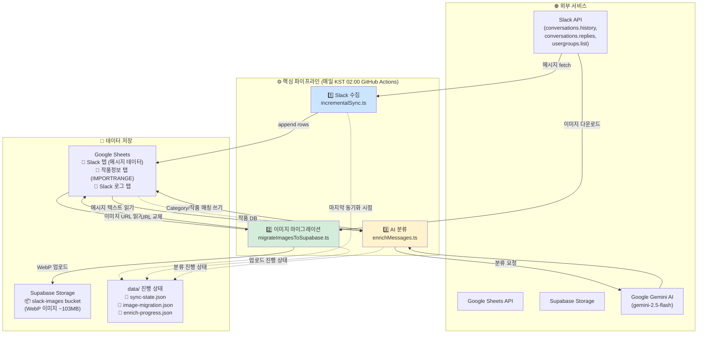
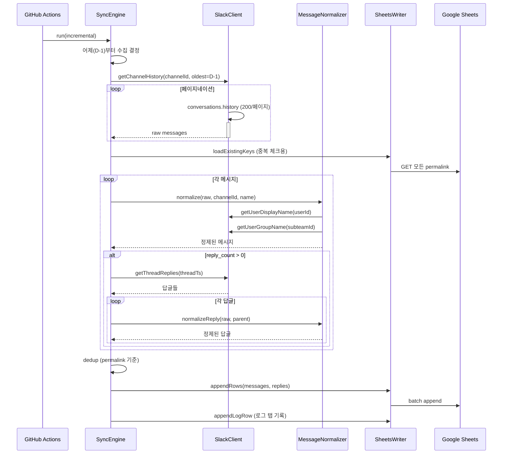
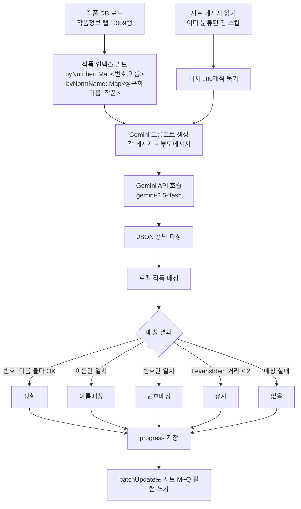
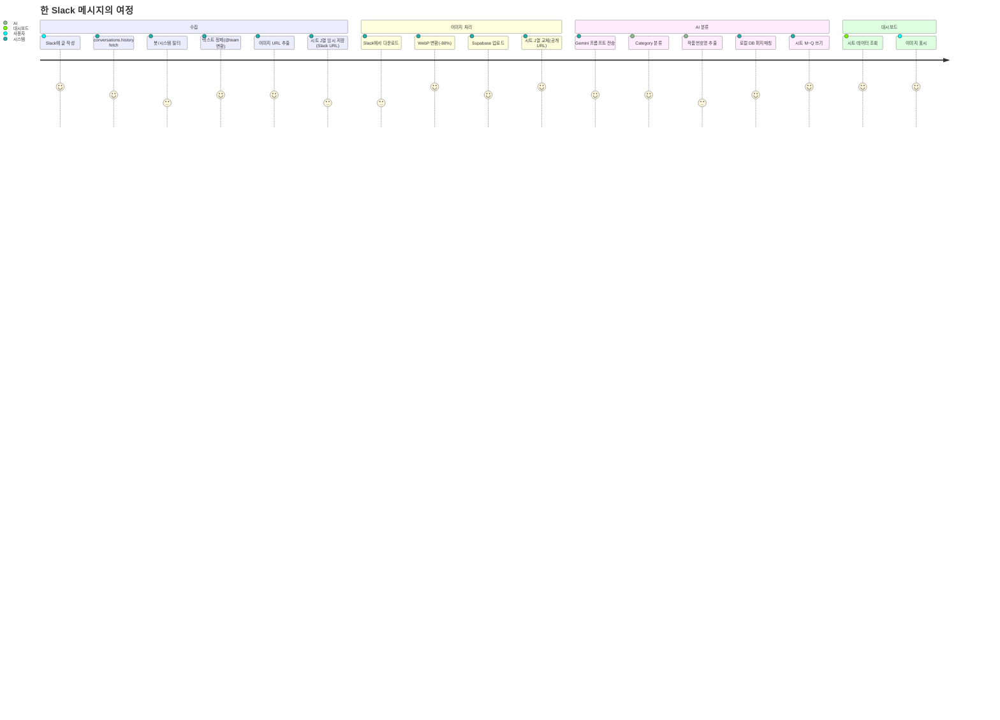

# 📡 Slack HUB — 시스템 아키텍처 문서

> 작품관련소통 Slack 채널의 메시지/답글/이미지를 자동 수집·분류해서 Google Sheets와 Supabase에 저장하는 파이프라인.
> 대시보드의 데이터 소스로 사용 예정.

---

## 1. 한 줄 요약

**Slack 채널 → (수집) → Google Sheets → (AI 분류 + 이미지 변환) → Supabase + Sheets** 를 매일 자동으로 돌리는 시스템.

---

## 2. 🔭 전체 아키텍처



---

## 3. 📊 매일 자동 실행되는 3단계

### 단계 1️⃣ — Slack 메시지 수집



**핵심 동작:**
- 매일 실행 시 **어제+오늘** 범위 가져옴 (D-1부터, 누락 방지용 1일 버퍼)
- 첫 실행: `SYNC_INITIAL_LOOKBACK_DAYS=0` → 채널 전체 히스토리
- 봇 메시지/시스템 메시지 자동 필터링
- 부모가 봇이어도 답글은 수집 (부모 텍스트는 `[봇/시스템 메시지]` 로 표시)
- `<!subteam^ID>` 멘션은 실제 팀명으로 변환 (예: `<!subteam^S06KDTH019D>` → `@글콘실`)

---

### 단계 2️⃣ — 이미지 마이그레이션

```mermaid
flowchart LR
    A[시트의 이미지 URL] -->|미처리 필터| B{이미 업로드?}
    B -->|예| Z[스킵]
    B -->|아니오| C[Slack에서 다운로드<br/>Authorization 헤더]
    C --> D[Sharp 라이브러리]
    D --> E{이미지 너무 큼?<br/>16000px 초과}
    E -->|예| F[리사이즈]
    E -->|아니오| G[WebP 변환<br/>quality 80]
    F --> G
    G --> H[Supabase Storage 업로드<br/>파일명: F{slack_file_id}.webp]
    H --> I[공개 URL 받기]
    I --> J[progress.json 저장]
    J --> K[batchUpdate로 시트 J열 교체<br/>Slack URL → Supabase URL]
```

**핵심 동작:**
- **Slack URL은 토큰 필요** → 대시보드에서 못 봄 → Supabase 공개 URL로 교체
- **WebP 변환**으로 평균 **88% 압축** (910MB → 103MB)
- 파일 ID로 dedup (같은 이미지 여러 메시지에 공유돼도 1번만 저장)
- 너무 큰 이미지(>16000px)는 리사이즈 후 변환
- 진행 중 끊겨도 `progress.json`으로 재시작 가능

---

### 단계 3️⃣ — AI 분류 (Gemini)



**Gemini가 추출하는 것:**
- **Category** (8가지): 원고/PSD, 일정/스케줄, 메타/작가, 라이센스/계약, 현지화/번역, BM/타입변경, 런칭/오픈, 기타
- **Sub Category**: 카테고리 내 세부 (예: 누락 페이지, 휴재, 작가 변경)
- **작품번호 후보** (메시지에서 추출)
- **작품명 후보**

**로컬 매칭 단계 (정확도 향상):**
1. 추출된 번호 + 이름 → DB에서 동시에 일치하면 `정확`
2. 번호 오타 의심 → 이름으로 DB 검색 → `이름매칭`
3. 이름 오타 의심 → Levenshtein 거리 ≤ 2 → `유사`
4. 매칭 안 됨 → `없음`

---

## 4. 📑 Google Sheets 구조

### "Slack" 탭 — 메인 데이터 (현재 14,346행)

| 컬럼 | 이름 | 예시 | 출처 |
|------|------|------|------|
| A | Is Reply | `TRUE` / `FALSE` | 수집 단계 |
| B | Channel | `작품관련소통_contentscomms` | 수집 단계 |
| C | Sender | `홍길동` | 수집 단계 |
| D | Date | `2026-05-21` | 수집 단계 |
| E | Time | `14:30:22` | 수집 단계 |
| F | Message | `8730 부녀회장 회차 누락...` | 수집 단계 |
| G | Link | `https://thetoomics.slack.com/...` | 수집 단계 |
| H | Parent Message | (답글일 때) `8730 부녀회장 작가 변경` | 수집 단계 |
| I | Parent Link | (답글일 때) 부모 permalink | 수집 단계 |
| J | Image URLs | `["https://supabase.../F08M.webp"]` | 이미지 마이그레이션 단계 |
| K | Image Count | `1` / `3` | 수집 단계 |
| L | Image Sizes (MB) | `2.45` (모든 이미지 합) | 수집 단계 |
| M | Category | `원고/PSD` | AI 분류 단계 |
| N | Sub Category | `누락 페이지` | AI 분류 단계 |
| O | 작품번호 | `8730` | AI 분류 + 매칭 단계 |
| P | 작품명 | `부녀회장` | AI 분류 + 매칭 단계 |
| Q | 작품매칭 | `정확` / `이름매칭` / `유사` / `없음` | 로컬 매칭 단계 |

### "작품정보" 탭 — 작품 DB

- IMPORTRANGE로 외부 시트와 연결됨
- A: 작품번호, B: 작품명
- 현재 2,009개 작품
- 외부 소스 업데이트되면 자동 반영

### "Slack 로그" 탭 — 실행 기록

| 컬럼 | 이름 |
|------|------|
| A | 실행일 |
| B | 실행 시간 |
| C | 소요 시간 |
| D | 모드 (전체/증분) |
| E | 신규 메시지 |
| F | 신규 답글 |

---

## 5. 🗂 코드 구조

```
HUB/
├── src/
│   ├── config/index.ts                  # 환경변수 로딩
│   ├── engine/SyncEngine.ts             # 수집 오케스트레이션
│   ├── jobs/incrementalSync.ts          # 진입점 (매일 실행)
│   ├── services/
│   │   ├── slack/
│   │   │   ├── SlackClient.ts          # Slack API 래퍼
│   │   │   ├── SlackCollector.ts        # 채널 히스토리 수집
│   │   │   ├── MessageNormalizer.ts     # 텍스트 정제, 멘션 변환
│   │   │   └── RateLimiter.ts           # Slack rate limit 처리
│   │   └── sheets/
│   │       ├── SheetsClient.ts          # Google Sheets API 래퍼
│   │       └── SheetsWriter.ts          # 행 추가, 헤더 보장
│   ├── types/slack.ts                   # 타입 정의
│   └── utils/
│       ├── dateUtils.ts                 # KST 날짜 포맷
│       ├── textUtils.ts                 # 메시지 정제
│       ├── logger.ts                    # 로깅
│       └── sleep.ts
├── scripts/
│   ├── migrateImagesToSupabase.ts       # 이미지 다운+WebP+업로드
│   ├── enrichMessages.ts                # Gemini 분류 + 작품 매칭
│   ├── clearSheet.ts                    # 데이터 초기화
│   ├── verifyData.ts                    # 시트 vs Slack 검증
│   ├── findOldest.ts                    # 첫 메시지 찾기
│   ├── analyzeImages.ts                 # 이미지 용량 분석
│   ├── estimateWebP.ts                  # WebP 압축률 측정
│   └── (기타 분석/디버깅 스크립트들)
├── .github/workflows/daily-sync.yml     # 매일 자동 실행
├── data/                                # 진행 상태 (gitignore)
└── .env                                 # 비밀 (gitignore)
```

---

## 6. 🔁 데이터 흐름 — 메시지 1개의 여정



---

## 7. 🔐 외부 서비스 & 비용

| 서비스 | 용도 | 무료 한도 | 현재 사용량 |
|--------|------|-----------|-------------|
| **Slack API** | 메시지/답글/이미지 | 무제한 (rate limit 있음) | ~3500 req/일 |
| **Google Sheets API** | 데이터 저장/조회 | 일 100,000 req | 일 ~200 |
| **Supabase Storage** | 이미지 호스팅 | **1 GB 무료** | **103 MB** (10%) |
| **Google Gemini AI** | 메시지 분류 | flash: 250 req/일 무료 | 일 ~10 req (증분) |
| **GitHub Actions** | 자동화 실행 | 월 2000분 무료 | 월 ~300분 |

**총 비용: 무료** 🎉

---

## 8. 🔑 환경 변수 (GitHub Secrets)

| Secret | 설명 |
|--------|------|
| `SLACK_BOT_TOKEN` | Slack User OAuth Token (xoxp-...) |
| `SLACK_TARGET_CHANNEL_ID` | 수집할 채널 ID |
| `SLACK_EXCLUDED_USER_IDS` | 제외할 유저 (선택) |
| `GOOGLE_SERVICE_ACCOUNT_KEY_BASE64` | Sheets 접근용 base64 |
| `GOOGLE_SHEETS_SPREADSHEET_ID` | HUB 시트 ID |
| `SUPABASE_URL` | Supabase 프로젝트 URL |
| `SUPABASE_SERVICE_ROLE_KEY` | Supabase 관리 키 |
| `SUPABASE_STORAGE_BUCKET` | 버킷명 (slack-images) |
| `GOOGLE_AI_API_KEY` | Gemini API 키 |

---

## 9. 🔧 진행 상태 보존 (`data/`)

3개의 JSON 파일로 **재시작 가능한 작업** 구현:

| 파일 | 용도 |
|------|------|
| `sync-state.json` | 마지막 동기화 시각 → 증분 수집 |
| `image-migration.json` | `{slack_url → supabase_url}` 매핑 |
| `enrich-progress.json` | `{시트행번호 → 분류결과}` |

→ 모두 GitHub Actions 캐시에 저장돼서 다음 실행 때 복원됨

---

## 10. ⚙️ Slack API Rate Limit 대응

`RateLimiter.ts`에 **Token Bucket 알고리즘** 구현:

| API Tier | 한도 | 우리 정책 |
|----------|------|-----------|
| Tier 2 (search.messages) | 15/min | 보수적, 안 씀 |
| Tier 3 (conversations.*) | 40/min | 토큰 10개 capacity |
| Tier 4 (users.info, auth) | 80/min | 토큰 10개 capacity |

- 429 응답 시 자동 retry (exponential backoff)
- 페이지네이션 시 300ms 대기

---

## 11. 🧪 검증 & 디버깅 스크립트

| 스크립트 | 용도 |
|----------|------|
| `verifyData.ts` | Slack 실제 카운트 vs 시트 카운트 비교 |
| `finalVerify.ts` | 봇/빈 메시지 필터링 후 정확 매칭 검증 |
| `diagnoseReplies.ts` | 스레드별 답글 누락 분석 |
| `analyzeImages.ts` | 시트의 이미지 용량 통계 |
| `analyzeReplies.ts` | 답글 봇 비율 샘플링 |
| `estimateWebP.ts` | WebP 압축률 실측 |
| `inspectThread.ts` | 특정 스레드 상세 분석 |
| `showFiltered.ts` | 필터링된 봇/시스템 메시지 예시 |

---

## 12. 📈 현재 데이터 현황 (2026-05-25 기준)

| 항목 | 값 |
|------|-----|
| 채널 기간 | 2024-02-21 ~ 2026-05-22 (약 2년 3개월) |
| 총 행 수 | **14,346** |
| 부모 메시지 | 2,767개 |
| 답글 | 11,579개 |
| 이미지 (고유) | 2,519장 |
| 이미지 용량 | 103.39 MB (WebP) |
| 작품 DB | 2,009개 |
| AI 분류 완료 | 3,332개 (23%) — 나머지 내일 Gemini quota 리셋 후 |

---

## 13. 🚀 다음 단계 (향후 계획)

- [ ] 남은 11,000개 AI 분류 완료
- [ ] **대시보드 프론트엔드** (Next.js + Supabase 직접 조회)
- [ ] PostgreSQL DB 마이그레이션 (옵션 — 시트가 무겁다면)
- [ ] 분류 통계 / 작품별 이슈 트렌드 시각화

---

**문의:** 코드 관련 질문은 슬랙 또는 GitHub Issues로!
