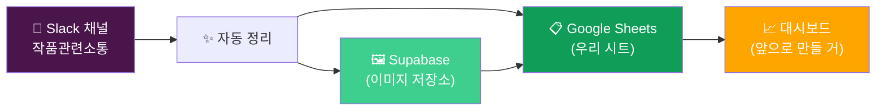
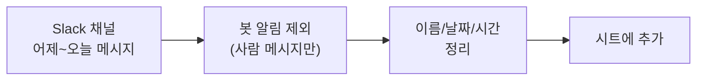
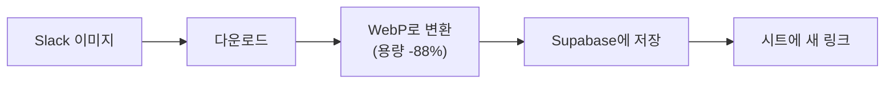
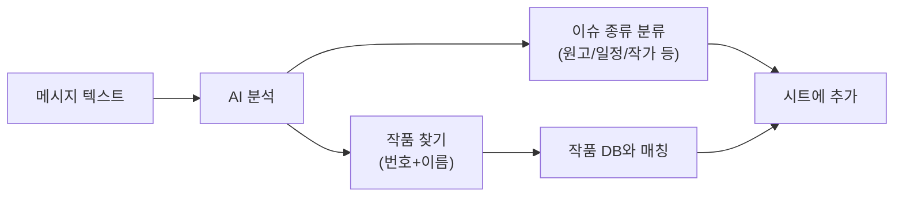
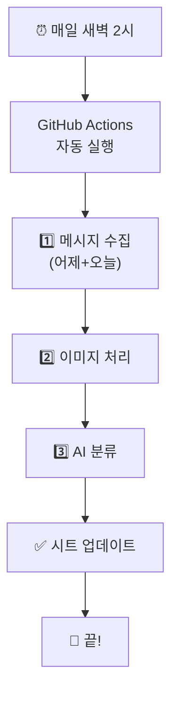

# 📡 Slack HUB

🌏 **한국어** | [English](./ARCHITECTURE.en.md)

> Slack 채널의 메시지를 자동으로 정리해서 Google Sheets에 모아주는 시스템

---

## 🎯 이게 뭐 하는 거?

매일 새벽 2시에 자동으로:

1. **Slack에서** 어제+오늘 메시지/답글을 가져와서
2. **이미지는 따로 저장**해서 어디서든 볼 수 있게 만들고
3. **AI로 자동 분류**해서 어떤 종류의 이슈인지, 어떤 작품인지 알려줌
4. 결과를 **Google Sheets**에 정리

→ 매일 출근하면 정리된 데이터가 시트에 들어가 있음 ✨

---

## 📊 큰 그림

---

## 🤖 매일 자동으로 하는 일

### 1단계 — 메시지 가져오기

- **사람이 쓴 메시지와 답글만** 골라냄 (자동 봇 알림은 제외)
- 멘션은 실제 이름으로 변환 (`<!subteam^...>` → `@글콘실`)
- 답글이면 **원본 메시지도 같이 보여줌** (맥락 파악용)

### 2단계 — 이미지 정리

- Slack 이미지는 로그인해야 보임 → **대시보드에서 안 보임**
- 그래서 **공개 링크로 변환**해서 따로 저장
- 용량도 **88% 압축** (910MB → 103MB)

### 3단계 — AI 자동 분류

- 메시지 보고 **어떤 종류 이슈인지** 분류 (8가지 카테고리)
- 메시지에서 **작품번호/작품명을 찾아서** 작품 DB와 매칭
- 오타도 자동 보정 (예: `8731 부녀회장` → DB에는 `8730 부녀회장` → 정정)

---

## 📋 시트에 뭐가 들어가?

| 컬럼 | 내용 | 예시 |
|------|------|------|
| Is Reply | 답글 여부 | `TRUE` (답글) / `FALSE` (원본) |
| Channel | 채널 이름 | `작품관련소통_contentscomms` |
| Sender | 작성자 | `홍길동` |
| Date / Time | 날짜·시간 (KST) | `2026-05-21 / 14:30:22` |
| Message | 메시지 내용 | `8730 부녀회장 회차 누락` |
| Link | 슬랙 원본 링크 | (클릭하면 슬랙으로 이동) |
| Parent Message | (답글일 때) 원본 메시지 | `8730 부녀회장 작가 변경 건...` |
| Parent Link | (답글일 때) 원본 링크 | (클릭하면 슬랙으로 이동) |
| Image URLs | 이미지 공개 링크 | `["https://...webp"]` |
| Image Count | 이미지 개수 | `2` |
| Image Sizes (MB) | 이미지 총 용량 | `1.85` |
| **Category** | AI 이슈 분류 | `원고/PSD` |
| **Sub Category** | 세부 분류 | `누락 페이지` |
| **작품번호** | 자동 추출 | `8730` |
| **작품명** | 자동 추출 | `부녀회장` |
| **작품매칭** | 신뢰도 | `정확` / `이름매칭` / `유사` / `없음` |

---

## 🏷️ AI가 분류하는 8가지 카테고리

| Category | 예시 |
|----------|------|
| 📄 **원고/PSD** | 누락 페이지, PSD 이슈, 로고 없음, 원고 수정/교체 |
| 📅 **일정/스케줄** | 업로드 일정, 휴재, 연재 재개/중단 |
| ✍️ **메타/작가** | 작가 변경, 제목 변경, 시즌/외전 |
| 📜 **라이센스/계약** | 판권 종료, 서비스 종료 |
| 🌐 **현지화/번역** | 번역 중단, 언어별 이슈 |
| 💰 **BM/타입변경** | BM 변경, 가격 변경 |
| 🚀 **런칭/오픈** | 신규 런칭, 무검열 런칭 |
| 💬 **기타** | 일반 잡담, 분류 어려운 것 |

---

## 🎯 작품 매칭 신뢰도

| 표시 | 의미 |
|------|------|
| **정확** | 번호+이름 둘 다 DB와 일치 ✅ |
| **이름매칭** | 번호는 다른데 이름이 일치 → DB의 정확한 번호로 정정 |
| **번호매칭** | 번호만 있고 이름은 없음 |
| **유사** | 오타 가능성 → 가장 비슷한 작품으로 추정 |
| **없음** | 작품 정보를 못 찾음 (예: 답글 "확인했습니다") |

---

## 📈 지금까지 모은 데이터

| 항목 | 수치 |
|------|------|
| 기간 | 2024년 2월 ~ 2026년 5월 (약 **2년 3개월**) |
| 전체 행 | **14,346개** |
| 사람 메시지 | 2,767개 |
| 사람 답글 | 11,579개 |
| 이미지 | 2,519장 (103 MB) |
| 작품 DB | 2,009개 |
| AI 분류 진행 | 3,332개 (다음 주 완료 예정) |

---

## 🆓 비용

**전부 무료** 사용 중:
- Slack API
- Google Sheets
- Supabase Storage (1GB 무료, 현재 10% 사용)
- Google Gemini AI (무료 한도 내)
- GitHub Actions (자동 실행 무료)

---

## 🔄 매일 어떻게 실행돼?

- 컴퓨터 꺼져있어도 **클라우드에서 자동 실행**
- 매일 새 메시지 **10-50개 정도**만 처리 (1-2분)
- 한번 실패해도 다음 날 자동으로 빠진 거 채워줌

---

## 💡 앞으로 할 것

- [ ] AI 분류 마무리 (남은 11,000개)
- [ ] **대시보드 만들기** — 시트 보지 않고 웹에서 검색/필터/시각화
- [ ] 작품별 이슈 트렌드 시각화
- [ ] 자동 알림 (특정 이슈 발생 시)

---

## ❓ 자주 묻는 질문

**Q. 새 메시지는 언제 시트에 들어와요?**
→ 매일 새벽 2시 자동으로. 즉시 필요하면 수동 실행 가능.

**Q. 봇 알림이 시트에 안 보여요?**
→ 봇 메시지는 자동으로 제외함 (`B098BGM0L15` 같은 자동 알림은 사람 대화 아니라서).

**Q. AI 분류가 틀렸어요. 어떻게 하죠?**
→ 시트에서 직접 수정 가능. 다음 자동 실행에서 덮어쓰지 않아요.

**Q. 작품 DB 업데이트는 어떻게 돼요?**
→ "작품정보" 탭이 외부 DB와 자동 연결돼 있어서 항상 최신.

**Q. 이미지가 갑자기 안 보여요?**
→ Supabase 무료 한도(1GB) 넘어가면 작동 안 함. 현재 10%라 여유 있음.

---

문의나 요청은 슬랙으로 알려주세요! 🙌
